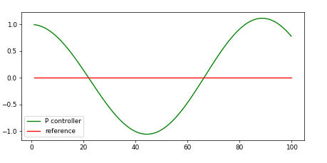
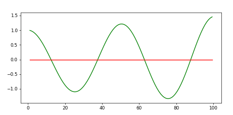
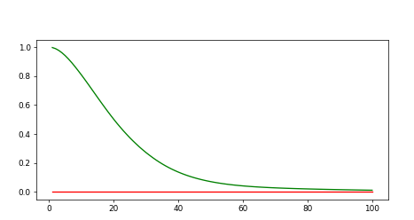
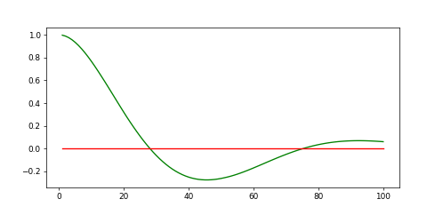
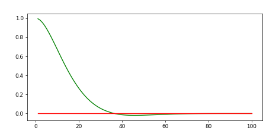
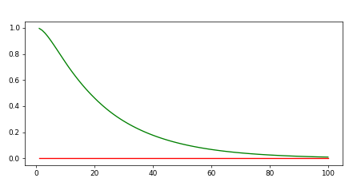

# CarND-Controls-PID
Self-Driving Car Engineer Nanodegree Program

---
## PID-Control

It is build for 3 components

P - Proportional Control

I - Integral Control

D - Differential Control

each of which plays different role in calculating correct values.

### P - Proportional Control

We can define it as `tau_p * CTE`. Unfortunately using only this part won't give us good results. it will just change the value of out current `CTE` by some factor. We can control the `oscillation` by this parameter, the higher it is the faster value oscillates.

`tau_p = 0.1`


`tau_p = 0.3`


### I - Integral Control

Using this control we are able to reduce bias of our system. It is defined as `tau_i * sum(CTE)`. In this project this control didn't take significant part, but for the sake of project I decided to use it with very little `tau_i` value. The smaller value of `tau_i` the slower the bias is removed, however you need to be careful as this can lead to overshoot if value is to big.

`tau_i 0.004(with bias 0.1)`


`tau_i 0.01(with bias 0.1)`


### Differential Control

This control allows us to prevent our controller from overshooting. It is defined as `tau_d * diff_cte / delta_t` where `diff_cte = current_cte - previous_cte` in time. The higher value of `tau_d` the slower control will reach the 0 value.

`tau_d = 3.0`


`tau_d = 5.0`


## Choosing Hyperparametes

I decided to do it by starting from ones presented in labs and tune then by modifying one at the time and checking the results. I decided to use 2 PID controllers so after I was done with steering I started to adjust speed controller with the same technic. The only bigger difference was that I has to change a little the range for speed controller as it needs values `[0..1]`.

Final parameters for my simulation are:

Steering Controller:
- tau_p `0.19` - Smaller value than in speed controller as here the oscillations made the car go off the track if this value was getting bigger.
- tau_i `0.0000001` - not needed in simulator
- tau_d `3.0` - Smoother the correction of steering angle. But when the value was bigger the correction was to slow.

Speed Controller:
- tau_p `0.85` - the bigger value the more often response to CTE which was needed because I wanted to make the car get and reduce the speed fast.
- tau_i `0.0000001` - not needed in simulator
- tau_d `2.0` - The bigger this value was the slower the correction of speed was.

## Dependencies

* cmake >= 3.5
 * All OSes: [click here for installation instructions](https://cmake.org/install/)
* make >= 4.1
  * Linux: make is installed by default on most Linux distros
  * Mac: [install Xcode command line tools to get make](https://developer.apple.com/xcode/features/)
  * Windows: [Click here for installation instructions](http://gnuwin32.sourceforge.net/packages/make.htm)
* gcc/g++ >= 5.4
  * Linux: gcc / g++ is installed by default on most Linux distros
  * Mac: same deal as make - [install Xcode command line tools]((https://developer.apple.com/xcode/features/)
  * Windows: recommend using [MinGW](http://www.mingw.org/)
* [uWebSockets](https://github.com/uWebSockets/uWebSockets)
  * Run either `./install-mac.sh` or `./install-ubuntu.sh`.
  * If you install from source, checkout to commit `e94b6e1`, i.e.
    ```
    git clone https://github.com/uWebSockets/uWebSockets
    cd uWebSockets
    git checkout e94b6e1
    ```
    Some function signatures have changed in v0.14.x. See [this PR](https://github.com/udacity/CarND-MPC-Project/pull/3) for more details.
* Simulator. You can download these from the [project intro page](https://github.com/udacity/self-driving-car-sim/releases) in the classroom.

There's an experimental patch for windows in this [PR](https://github.com/udacity/CarND-PID-Control-Project/pull/3)

## Basic Build Instructions

1. Clone this repo.
2. Make a build directory: `mkdir build && cd build`
3. Compile: `cmake .. && make`
4. Run it: `./pid`.

## Editor Settings

We've purposefully kept editor configuration files out of this repo in order to
keep it as simple and environment agnostic as possible. However, we recommend
using the following settings:

* indent using spaces
* set tab width to 2 spaces (keeps the matrices in source code aligned)

## Code Style

Please (do your best to) stick to [Google's C++ style guide](https://google.github.io/styleguide/cppguide.html).

## Project Instructions and Rubric

Note: regardless of the changes you make, your project must be buildable using
cmake and make!

More information is only accessible by people who are already enrolled in Term 2
of CarND. If you are enrolled, see [the project page](https://classroom.udacity.com/nanodegrees/nd013/parts/40f38239-66b6-46ec-ae68-03afd8a601c8/modules/f1820894-8322-4bb3-81aa-b26b3c6dcbaf/lessons/e8235395-22dd-4b87-88e0-d108c5e5bbf4/concepts/6a4d8d42-6a04-4aa6-b284-1697c0fd6562)
for instructions and the project rubric.

## Hints!

* You don't have to follow this directory structure, but if you do, your work
  will span all of the .cpp files here. Keep an eye out for TODOs.

## Call for IDE Profiles Pull Requests

Help your fellow students!

We decided to create Makefiles with cmake to keep this project as platform
agnostic as possible. Similarly, we omitted IDE profiles in order to we ensure
that students don't feel pressured to use one IDE or another.

However! I'd love to help people get up and running with their IDEs of choice.
If you've created a profile for an IDE that you think other students would
appreciate, we'd love to have you add the requisite profile files and
instructions to ide_profiles/. For example if you wanted to add a VS Code
profile, you'd add:

* /ide_profiles/vscode/.vscode
* /ide_profiles/vscode/README.md

The README should explain what the profile does, how to take advantage of it,
and how to install it.

Frankly, I've never been involved in a project with multiple IDE profiles
before. I believe the best way to handle this would be to keep them out of the
repo root to avoid clutter. My expectation is that most profiles will include
instructions to copy files to a new location to get picked up by the IDE, but
that's just a guess.

One last note here: regardless of the IDE used, every submitted project must
still be compilable with cmake and make./
